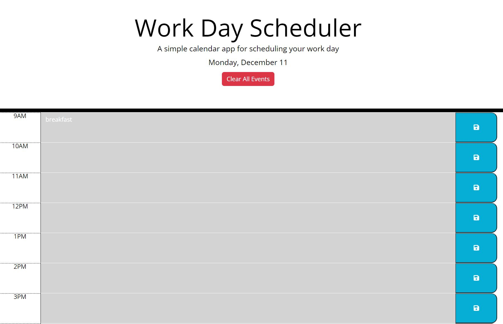

# Work-Day-Scheduler
A repo containing a simple calendar application that allows a user to save events for each hour of the day

## Description

This project aims create a calendar application that will run in the browser, and will feature dynamically updated HTML and CSS powered by JQuery.

## Table of Contents

- [Installation](#installation)
- [Usage](#usage)
- [Credits](#credits)
- [License](#license)

## Installation

Follow the URL link provided: https://jsskilton.github.io/Work-Day-Scheduler/

## Usage

The current day is displayed at the top of the calender when opened. Timeblocks for standard business hours are presented. Each timeblock is color-coded based on past, present, and future when the timeblock is viewed. Events can be entered into a timeslot when a timeblock is clicked. Events are saved in local storage when the save button is clicked in that timeblock.

## Credits

This README was created by following the Good-README-Guide on git.bootcampcontent:

https://git.bootcampcontent.com/uk-edx-16-week/UK-VIRT-FE-PT-10-2023-U-LOLC/-/blob/main/01-html-git-github-module/04-code-refactor-lesson/challenge/Good-README-Guide.md

## License

MIT License